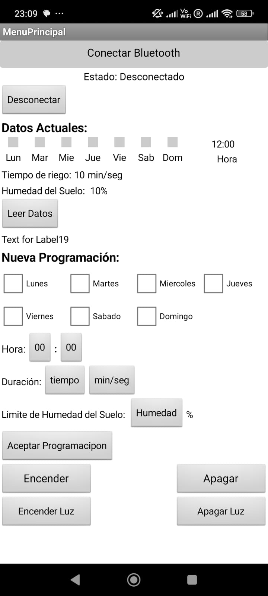
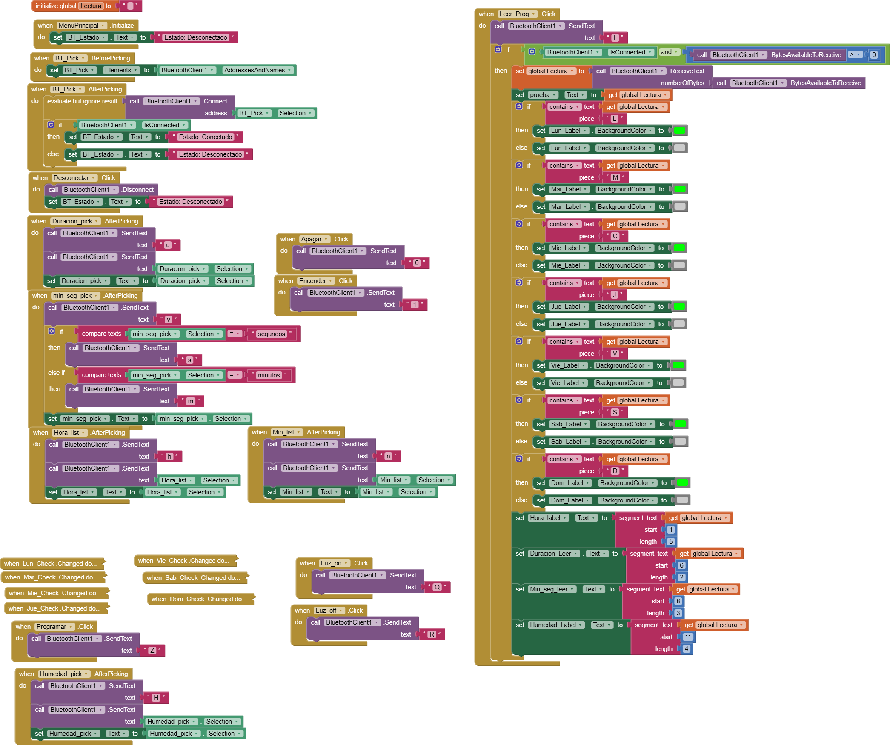

# Smart Irrigation Pot 🌱💧

A self-watering smart pot designed and built from scratch using Arduino Nano, sensors, and a mobile app.  
The system measures soil humidity and automatically irrigates the plant when needed, while also allowing the user to control irrigation and lighting remotely.  
This project combines **automation, IoT, and sustainability** to support urban gardening and smart farming solutions.  

---

## 🚀 Features
- Real-time soil moisture monitoring  
- Automatic irrigation with water pump  
- Mobile app for scheduling and manual control  
- Custom PCB design  
- Integrated grow light with scheduling/override options  
- Prototype housing modeled in CAD  

---

## 🛠️ Technologies Used
- **Arduino Nano** (C++ for microcontroller programming)  
- **Soil moisture sensor + water pump**  
- **PCB design** in Fritzing/Eagle  
- **CAD design** in Autodesk Inventor  
- **Mobile app** MIT AppInventor   

---

## 🔧 How It Works
1. The soil moisture sensor continuously monitors the plant’s humidity levels.  
2. The Arduino Nano processes this data and compares it against predefined thresholds.  
3. If the soil is too dry **and irrigation is scheduled by the user**, the water pump is activated automatically.  
4. The user can also **manually override irrigation** at any time via the mobile app.  
5. In addition, a **grow light** can be scheduled or controlled manually through the app, ensuring optimal plant growth.  

---

## 📷 Project Gallery
<p align="center">
  <br>
  <em>CAD design of the structure</em>
</p>

<p align="center">
  <br>
  <em>The assembled smart irrigation pot prototype</em>
</p>

<p align="center">
  
  <br>
  <em>Custom PCB for the control system</em>
</p>

<p align="center">
  
  <br>
  <em>Mobile app interface and control logic</em>
</p>


---

## 🌍 Impact
This project can scale to **urban gardening and greenhouse automation**.  
It helps save water, reduce human error, and improve plant health — contributing to **sustainable agriculture and environmental protection**.  

---

## 📂 Repository Structure
```text
├── hardware/
│   ├── PCB_top.jpg
│   ├── PCB_bottom.jpg
│   ├── Structure.png
├── software/
│   ├── main.ino
│   ├── App_Screenshot.jpg
│   ├── blocks.png
│   ├── RiegoAuto_ConLuz.aia
├── images/
│   ├── Tower_with_pot.jpg
└── README.md
```

---

## 👨‍💻 Author
**Patricio Flores**  
- MSc Automation & Control
- Passionate about Automation, IoT, and GreenTech 🌱  
- [LinkedIn Profile](https://www.linkedin.com/in/patricio-flores-juarez)  

